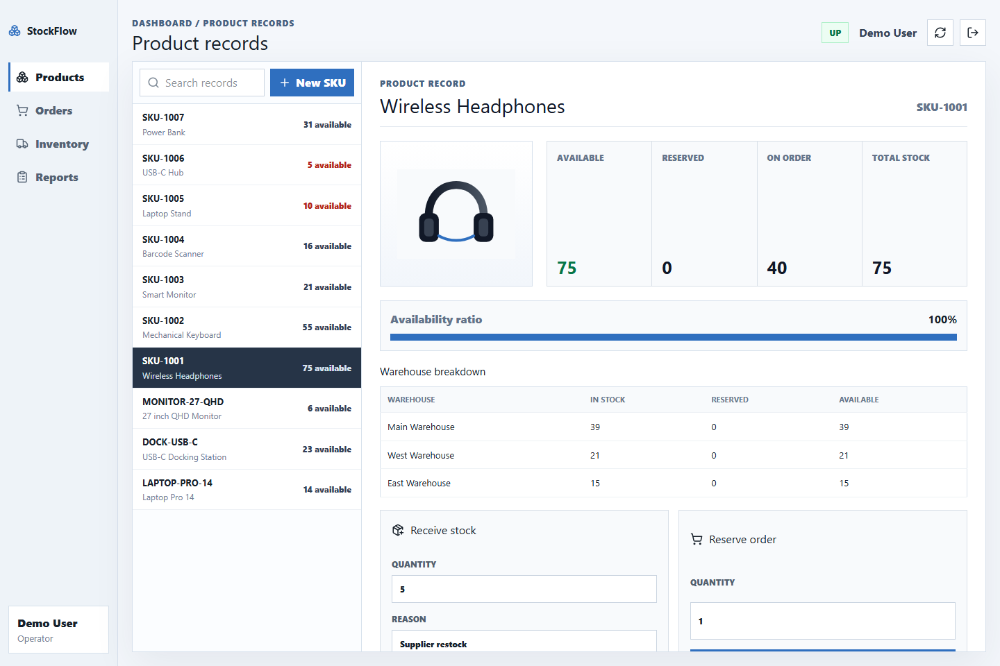
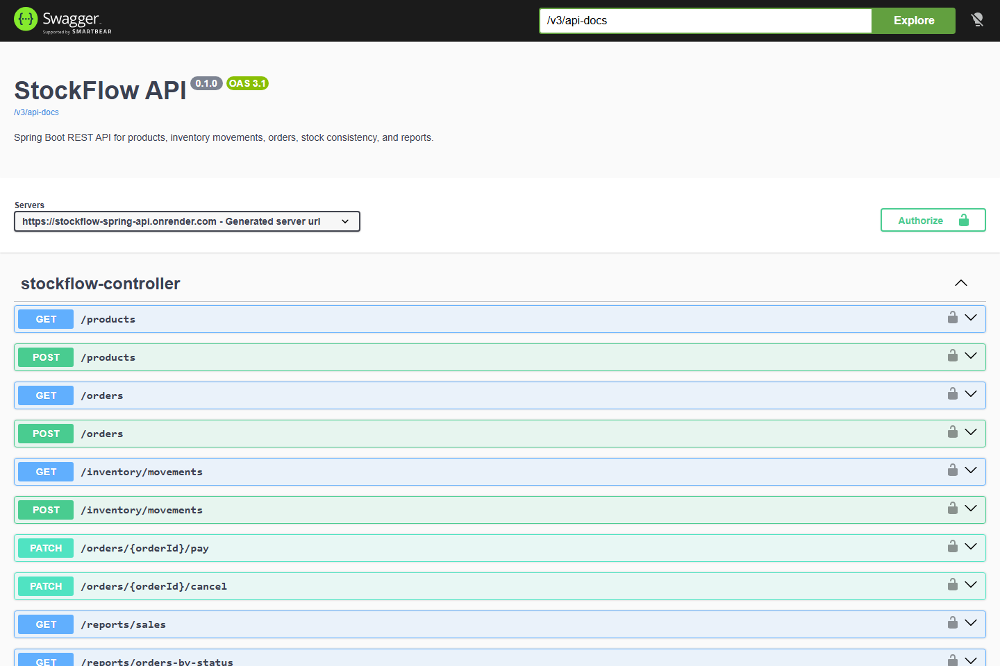
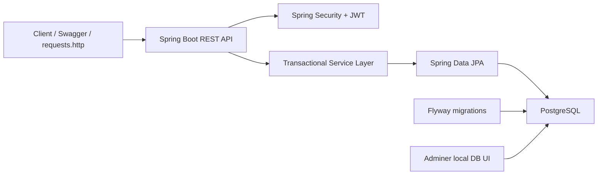
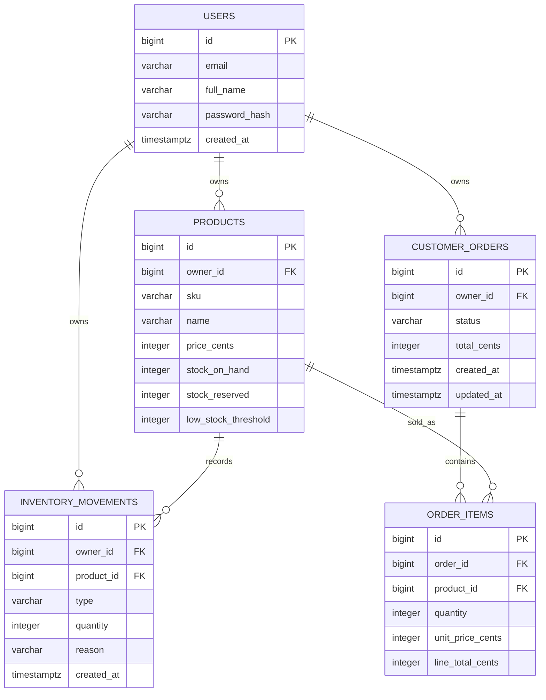

# StockFlow API

[](https://github.com/alvarolomba/stockflow-api/actions/workflows/ci.yml)


Transactional inventory and orders backend built with Java, Spring Boot, PostgreSQL, Flyway, JWT authentication, Docker Compose, Swagger/OpenAPI, and PostgreSQL-backed integration tests.

The project focuses on data consistency, transaction boundaries, API design, authentication, database modelling, and operational documentation. It is designed to run with a managed PostgreSQL database such as Supabase and a container host such as Render.

## Project Links

- Live dashboard: [https://stock-flow-dashboard.vercel.app](https://stock-flow-dashboard.vercel.app)
- Render API: [https://stockflow-spring-api.onrender.com](https://stockflow-spring-api.onrender.com)
- Swagger UI: [https://stockflow-spring-api.onrender.com/swagger-ui.html](https://stockflow-spring-api.onrender.com/swagger-ui.html)
- Frontend dashboard repository: [https://github.com/alvarolomba/stockflow-dashboard](https://github.com/alvarolomba/stockflow-dashboard)
- Local Swagger UI: [http://localhost:8080/swagger-ui.html](http://localhost:8080/swagger-ui.html)
- Local API health: [http://localhost:8080/actuator/health](http://localhost:8080/actuator/health)

## Preview

Dashboard product record view:



Swagger/OpenAPI documentation:



## Demo Access

Use this shared account to explore the deployed API and dashboard with preloaded products, stock movements, orders, and reports:

```text
Email: demo@alvarolomba.dev
Password: DemoPassword123!
```

This account contains demo data only. You can also register a new account from the dashboard or Swagger.

## Demo Path

1. Open the [live dashboard](https://stock-flow-dashboard.vercel.app).
2. Log in with the demo account above.
3. Review the product records and stock availability.
4. Open the orders view and inspect pending, paid, and canceled orders.
5. Use the inventory view to see the movement audit trail.
6. Open reports to review low-stock, sales, and order-status summaries.

## Demo Availability

The API is hosted on Render's free tier, so the first request after inactivity may be slower while the Spring Boot service wakes up.

## What This Demonstrates

- Secure REST API design with JWT bearer authentication.
- User-owned data isolation across products, stock movements, and orders.
- PostgreSQL relational modelling with explicit Flyway migrations.
- Transactional business rules for stock reservation, release, and sale.
- Pessimistic row locking when stock is changed, preventing overselling under concurrent orders.
- Integration tests against real PostgreSQL using Testcontainers.
- Dockerized local development with Adminer for database inspection.
- Production-minded documentation: Swagger, request examples, architecture notes, trade-offs, and operational considerations.

## Core Business Rules

- Products have stock on hand, reserved stock, available stock, and a low-stock threshold.
- Creating an order validates available stock before changing data.
- Creating an order reserves stock immediately.
- Canceling a pending order releases reserved stock.
- Paying a pending order converts reserved stock into sold stock.
- Paid orders cannot be canceled.
- Canceled orders cannot be paid.

## Tech Stack

- Java 17
- Spring Boot 4
- Spring Web MVC
- Spring Security
- Spring Data JPA
- PostgreSQL
- Flyway
- JWT
- Swagger UI / OpenAPI
- Maven
- Docker Compose
- Adminer
- Testcontainers
- GitHub Actions

## Architecture



## Data Model



## API Overview

| Method | Endpoint | Purpose |
| --- | --- | --- |
| `POST` | `/auth/register` | Create a user account |
| `POST` | `/auth/login` | Return a JWT access token |
| `GET` | `/auth/me` | Read the current user |
| `POST` | `/products` | Create a product with initial stock |
| `GET` | `/products` | List products for the authenticated user |
| `POST` | `/inventory/movements` | Add stock to a product |
| `GET` | `/inventory/movements` | List inventory audit movements |
| `POST` | `/orders` | Create an order and reserve stock |
| `GET` | `/orders` | List orders |
| `PATCH` | `/orders/{orderId}/pay` | Mark an order as paid and sell reserved stock |
| `PATCH` | `/orders/{orderId}/cancel` | Cancel a pending order and release reserved stock |
| `GET` | `/reports/low-stock` | Show products at or below threshold |
| `GET` | `/reports/sales` | Show paid order and revenue totals |
| `GET` | `/reports/orders-by-status` | Show order counts by status |

## Run Locally

Requirements:

- Java 17
- Maven
- Docker Desktop

Start the API, PostgreSQL, and Adminer:

```bash
docker compose up -d --build
```

Useful URLs:

- API health: [http://localhost:8080/actuator/health](http://localhost:8080/actuator/health)
- Swagger UI: [http://localhost:8080/swagger-ui.html](http://localhost:8080/swagger-ui.html)
- Adminer: [http://localhost:8081](http://localhost:8081)

Adminer local credentials:

- System: `PostgreSQL`
- Server: `db`
- Username: `stockflow`
- Password: `stockflow`
- Database: `stockflow`

Stop the local stack:

```bash
docker compose down
```

## Test The API

The repository includes [requests.http](./requests.http), which walks through a complete flow:

1. Register
2. Login
3. Create product
4. Add inventory
5. Read inventory movements
6. Create order
7. Pay order
8. Read reports

You can also use Swagger UI and the `Authorize` button with:

```text
Bearer <accessToken>
```

## Run Tests

Tests use Testcontainers, so Docker Desktop must be running.

```bash
mvn test
```

The integration tests cover:

- Register/login/current user flow.
- Duplicate email rejection.
- Order creation with stock reservation.
- Paid order revenue reports.
- Order cancellation and stock release.
- Rejection when order quantity exceeds available stock.
- User-owned data isolation.
- Protected endpoints requiring authentication.

## Trade-Offs

- The API stores money as integer cents to avoid floating-point precision issues.
- Stock consistency is handled in a transactional service layer with pessimistic row locking around product stock changes.
- The backend is the main portfolio artifact; a lightweight React dashboard can be deployed separately on Vercel.
- The current payment operation is an internal state transition, not a real payment processor integration.

## Production Considerations

- Use managed PostgreSQL, for example Supabase, with Flyway-owned schema migrations.
- When using the Supabase transaction pooler, the API disables PostgreSQL server prepared statements with `prepareThreshold=0` to avoid pooler conflicts.
- Supabase Row Level Security is enabled on application tables with backend-only access through the Spring Boot API.
- Add request tracing, structured logs, and metrics dashboards.
- Store JWT secrets in a managed secret store.
- Add pagination and filtering for products/orders at scale.
- Add audit views for inventory movements.
- Deploy with managed PostgreSQL, health checks, and CI/CD.

## Summary

Built a transactional inventory and orders backend in Spring Boot with JWT auth, PostgreSQL, Flyway migrations, Docker Compose, Swagger, and Testcontainers. The project focuses on stock consistency: orders reserve stock, cancellation releases it, payment converts reserved stock into sold inventory, and reports expose low-stock and sales metrics.
